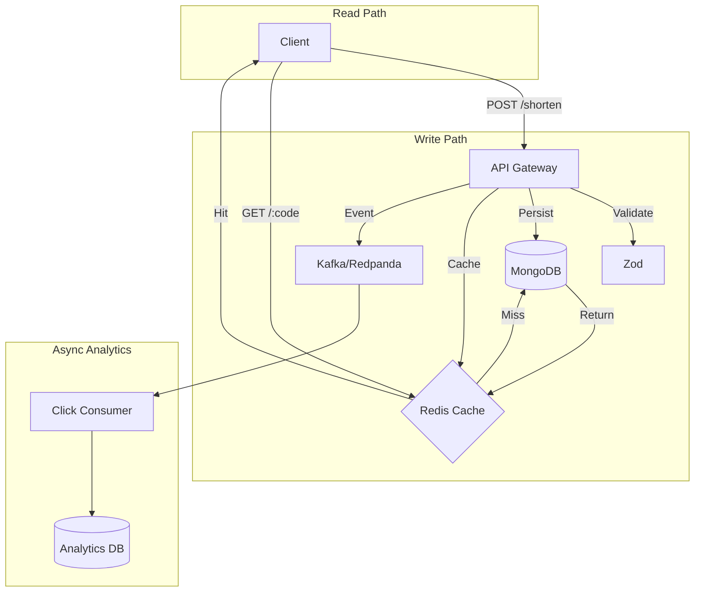

# SHORTsee | High-Performance URL Shortener

**SHORTsee** is a production-grade URL shortening service designed for speed, reliability, and usability. It features a blazing-fast backend (Redis + MongoDB + Kafka) and a polished & Minimal React frontend.


---

## Features

### Frontend (v3.3)

- **Modern UI**: "Minimalistic" aesthetic.
- **Theming**: robust Dark/Light mode switcher with persistent preferences.
- **Smart UX**:
  - Auto-generated **QR Codes** for every link.
  - **Local History** to track your shortened URLs.
  - **One-click Copy** and Share functionality.
- **Performance**: Built with Vite + React for instant loads.

### Backend Performance Strategy

- **Low Latency**: Redirects in <20ms using Redis (Hot Path).
- **Architecture**:
  - **Write Path**: Async processing with Kafka/Redpanda.
  - **Read Path**: Cache-first (Redis) -> DB (MongoDB) fallback.
  - **Scalability**: Stateless API design.
- **Reliability**: Race-condition proof ID generation (Base62).

---

## Tech Stack

- **Frontend**: React, Vite, Vanilla CSS, Phosphor Icons (SVG).
- **Backend**: Node.js, Express, Zod (Validation).
- **Data**: MongoDB (Source of Truth), Redis (Cache), Redpanda/Kafka (Events).
- **Infrastructure**: Docker Compose.

---

## Architecture

### Core Principles

1. **Redirect path must be minimal** & synchronous.
2. **Reads ≫ Writes**: Optimized for read-heavy traffic.
3. **Async everything** except the redirect.
4. **Cache first, DB second**.

### Data Flow



---

## Getting Started

### Prerequisites

- Docker & Docker Compose
- Node.js (v18+)

### 1. Start Infrastructure

Start MongoDB, Redis, and Redpanda containers:

```bash
docker-compose up -d
```

### 2. Start Backend

Install dependencies and start the API server:

```bash
# In the root directory
npm install
npm run dev
```

_Server runs on `http://localhost:3000`_

### 3. Start Frontend

Install dependencies and start the Vite dev server:

```bash
cd frontend
npm install
npm run dev
```

_Frontend runs on `http://localhost:5173`_

---

## API Reference

| Method | Endpoint           | Description                                   |
| :----- | :----------------- | :-------------------------------------------- |
| `POST` | `/api/shorten`     | Shorten a URL. Body: `{ "longUrl": "..." }`   |
| `GET`  | `/api/stats/:code` | Get metadata (clicks, date) for a short code. |
| `GET`  | `/:code`           | Redirect to the original URL.                 |
| `GET`  | `/health`          | Server health check.                          |

---

## Testing Strategy

- **Unit Tests**: Service logic isolated tests.
- **Integration Tests**: API route testing.
- **Load Testing**: Redis/Kafka throughput validation.

---

**Created by [cmiski](https://github.com/cmiski)**
